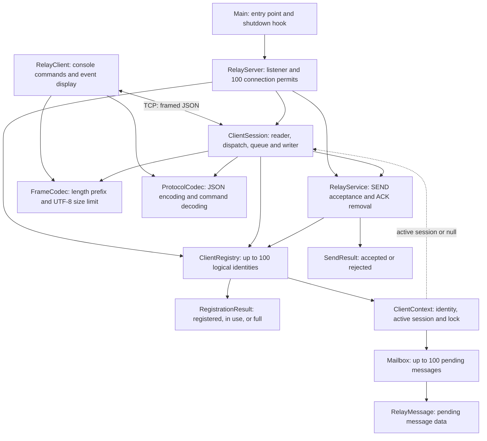
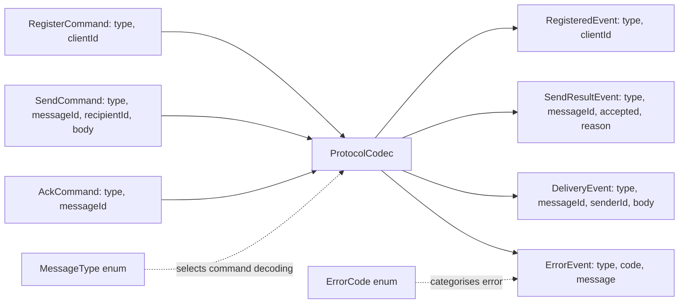
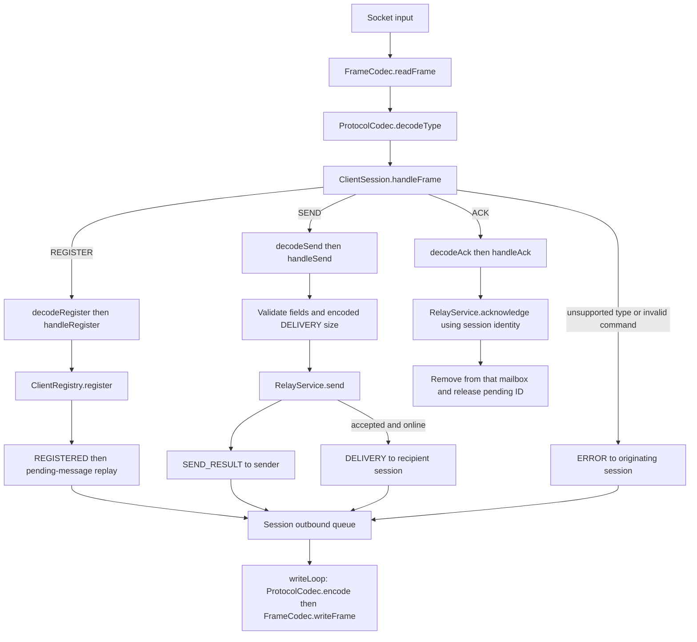
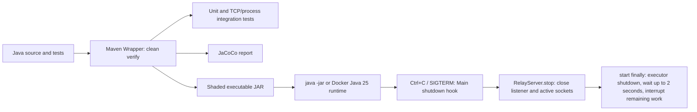

# Design Map

A source-oriented guide to the relay. There are **no HTTP routes**: one persistent TCP connection carries framed JSON commands in both directions. The `type` field selects a command handler.

- [README.md](README.md): prerequisites, build/test/run commands and demonstrations.
- [APPROACH.md](APPROACH.md): acceptance criteria, wire examples, decisions and limitations.
- This document: every application type, command routes, state ownership and test responsibilities.

The diagrams use Mermaid so they can be viewed directly in GitHub without a separate diagramming tool.

## 1. Application Class Map

Arrows mean calls or ownership, except the labelled TCP link. The CLI and server run in separate JVMs. Each admitted connection has its own `ClientSession`; registry and service instances are shared by the server's sessions.



| Type | Source | Responsibility / boundary |
| --- | --- | --- |
| `Main` | [Main.java](src/main/java/com/messagerelay/Main.java) | Reads the optional port, creates the server, installs the shutdown hook, calls `start()`. |
| `RelayClient` | [RelayClient.java](src/main/java/com/messagerelay/client/RelayClient.java) | Registers on startup; translates console `send`/`ack` into commands; reads and displays server frames on a virtual thread. Reconnect is manual. |
| `RelayServer` | [RelayServer.java](src/main/java/com/messagerelay/server/RelayServer.java) | Binds TCP, admits up to 100 connections, starts sessions, tracks sockets and performs shutdown. Excess sockets close without a write. |
| `ClientSession` | [ClientSession.java](src/main/java/com/messagerelay/server/ClientSession.java) | Handles one connection's registration, validation, dispatch and delivery. Owns a 128-event outbound queue and one writer thread. |
| `ClientRegistry` | [ClientRegistry.java](src/main/java/com/messagerelay/server/ClientRegistry.java) | Retains at most 100 identities and reattaches existing offline identities. Disconnect clears only the matching active session. |
| `ClientRegistry.RegistrationResult` | [ClientRegistry.java](src/main/java/com/messagerelay/server/ClientRegistry.java) | Internal enum: `REGISTERED`, `IDENTITY_IN_USE`, `IDENTITY_LIMIT_REACHED`. The session maps failures to protocol errors. |
| `ClientContext` | [ClientContext.java](src/main/java/com/messagerelay/server/ClientContext.java) | Holds one logical identity, its mailbox, active session reference and `ReentrantLock`. Survives disconnect. |
| `Mailbox` | [Mailbox.java](src/main/java/com/messagerelay/server/mailbox/Mailbox.java) | Insertion-ordered deque of pending messages; capacity check, snapshot and ACK removal. Callers hold the context lock. |
| `RelayService` | [RelayService.java](src/main/java/com/messagerelay/service/RelayService.java) | Reserves globally unique pending IDs, stores accepted messages and removes recipient-owned messages on ACK. Does not write to sockets. |
| `RelayMessage` | [RelayMessage.java](src/main/java/com/messagerelay/domain/RelayMessage.java) | Internal immutable record: message ID, sender ID, recipient ID and body. |
| `SendResult` | [SendResult.java](src/main/java/com/messagerelay/domain/SendResult.java) | Internal result record with acceptance/rejection factory methods. Not itself the wire response. |
| `FrameCodec` | [FrameCodec.java](src/main/java/com/messagerelay/protocol/FrameCodec.java) | Reads/writes a four-byte big-endian length and UTF-8 JSON; limits payloads to 65,536 bytes. |
| `ProtocolCodec` | [ProtocolCodec.java](src/main/java/com/messagerelay/protocol/ProtocolCodec.java) | Uses Jackson to encode events/commands and decode the type and command records. Business validation stays in the session/service. |

## 2. Protocol Type Map

These records contain data, not mailbox or networking logic. `MessageType` is the discriminator on commands and events; `ErrorCode` appears only on `ErrorEvent`.



| Type | Source | Direction and purpose |
| --- | --- | --- |
| `RegisterCommand` | [RegisterCommand.java](src/main/java/com/messagerelay/protocol/commands/RegisterCommand.java) | Client to server: claim or reconnect an identity. |
| `SendCommand` | [SendCommand.java](src/main/java/com/messagerelay/protocol/commands/SendCommand.java) | Client to server: addressed message. Sender identity comes from the session. |
| `AckCommand` | [AckCommand.java](src/main/java/com/messagerelay/protocol/commands/AckCommand.java) | Client to server: explicitly acknowledge a message ID. |
| `RegisteredEvent` | [RegisteredEvent.java](src/main/java/com/messagerelay/protocol/events/RegisteredEvent.java) | Server to client: registration succeeded. |
| `SendResultEvent` | [SendResultEvent.java](src/main/java/com/messagerelay/protocol/events/SendResultEvent.java) | Server to sender: accepted into memory or rejected with a reason. |
| `DeliveryEvent` | [DeliveryEvent.java](src/main/java/com/messagerelay/protocol/events/DeliveryEvent.java) | Server to recipient: message requiring explicit ACK. |
| `ErrorEvent` | [ErrorEvent.java](src/main/java/com/messagerelay/protocol/events/ErrorEvent.java) | Server to client: protocol/registration error. |
| `MessageType` | [MessageType.java](src/main/java/com/messagerelay/protocol/types/MessageType.java) | `REGISTER`, `SEND`, `ACK`, `REGISTERED`, `SEND_RESULT`, `DELIVERY`, `ERROR`. Server accepts only the three command types. |
| `ErrorCode` | [ErrorCode.java](src/main/java/com/messagerelay/protocol/types/ErrorCode.java) | `IDENTITY_IN_USE`, `ALREADY_REGISTERED`, `INVALID_MESSAGE_TYPE`, `MALFORMED_MESSAGE`, `IDENTITY_LIMIT_REACHED`, `INVALID_MESSAGE`. |

## 3. Command Routes



| Input | Successful route | Rejection / failure |
| --- | --- | --- |
| TCP connect | `RelayServer.start` acquires a permit and submits `runSession`. | At 100 active connections: close immediately, no protocol frame. |
| `REGISTER` | Validate ID; `ClientRegistry.register`; queue `REGISTERED`; `deliverPendingMessages`. | Blank ID: `INVALID_MESSAGE`. Already registered socket: `ALREADY_REGISTERED`. Active ID: `IDENTITY_IN_USE`. New ID at capacity: `IDENTITY_LIMIT_REACHED`. |
| `SEND` | Validate fields and DELIVERY size; `RelayService.send` reserves ID and stores message; queue sender result; `deliverToOnlineRecipient`. | Bad fields: `ERROR`. Unregistered sender, unknown recipient, duplicate pending ID, full mailbox or oversized DELIVERY: rejected `SEND_RESULT`. |
| `ACK` | `RelayService.acknowledge` locks the registered recipient's mailbox, removes the ID and releases its reservation. | Blank ID: `INVALID_MESSAGE`. Otherwise unknown/repeated/wrong-recipient ACK is a no-op; an unregistered ACK is ignored. No ACK-success event. |
| Malformed JSON / command shape | No state change for rejected command. | `MALFORMED_MESSAGE`; connection can continue if its output queue remains usable. |
| Missing, unknown or server-only `type` | No command handler runs. | `INVALID_MESSAGE_TYPE`. |
| Invalid length, truncated stream or socket failure | Session cleanup and registry disconnect. | Affected socket closes; no guaranteed error frame. A partial frame on a still-open connection can wait indefinitely because there is no read deadline. |
| Full outbound queue | Queued messages remain subject to ACK semantics. | Close affected connection; pending mailbox entries survive for reconnect. |

CLI-only routes: `help` prints usage; empty lines do nothing; unknown commands print guidance; `quit` or console EOF exits and closes the socket. These are not network commands. The CLI displays server errors but does not automatically reconnect or negotiate another identity.

## 4. Delivery and Reconnect

```mermaid
sequenceDiagram
    participant Alice as Alice / RelayClient
    participant AS as Alice ClientSession
    participant Service as RelayService
    participant BobMailbox as Bob ClientContext / Mailbox
    participant BS as Bob ClientSession
    participant Bob as Bob / RelayClient
    Alice->>AS: SEND bob, msg-1, body
    AS->>AS: Validate fields and encoded DELIVERY size
    AS->>Service: send(RelayMessage)
    Service->>BobMailbox: Lock, insert pending message, unlock
    Service-->>AS: SendResult.accepted
    AS-->>Alice: Queue SEND_RESULT accepted
alt Bob online
AS->>BS: Queue DELIVERY via recipient context
BS-->>Bob: DELIVERY msg-1
Bob->>BS: Disconnect without ACK
BS->>BobMailbox: Clear matching active session; keep mailbox
    else Bob already offline
Note over BobMailbox: Message remains queued
end
Bob->>BS: New connection, REGISTER same ID
BS->>BobMailbox: Reattach existing context
BS-->>Bob: REGISTERED then pending DELIVERY msg-1
Bob->>BS: ACK msg-1
BS->>Service: acknowledge(bob, msg-1)
Service->>BobMailbox: Remove pending message under lock
Note over Service: Release pending message ID
```

The Bob session after reconnect is a new object; the context/mailbox is the same. Replay may duplicate a delivery, including when reconnect overlaps an online send. Clients must tolerate duplicates. The sender result is enqueued before delivery is requested, but independent socket writers mean Bob may observe DELIVERY before Alice observes SEND_RESULT.

Acceptance means stored in this process's memory, not received or durably saved. There is no periodic retry: unacknowledged messages replay on reconnect. ACKs are mailbox-scoped, and IDs can be reused after ACK, so delayed stale ACKs with reused IDs remain ambiguous. Strict concurrent FIFO is not promised.

## 5. State, Locks and Bounds

```mermaid
stateDiagram-v2
    [*] --> Unregistered: TCP admitted
    Unregistered --> Online: REGISTER succeeds
    Unregistered --> Unregistered: REGISTER rejected
    Online --> Offline: Socket closes; retain identity and mailbox
    Offline --> Online: New connection registers same identity
    Online --> Forgotten: Server process exits
    Offline --> Forgotten: Server process exits
    Forgotten --> [*]
```



`Unregistered` describes a connection. `Online` and `Offline` describe the retained logical identity. A rejected excess TCP connection never creates a session or logical identity.

| State / resource | Owner | Protection / bound |
| --- | --- | --- |
| Listening socket and admission | `RelayServer` | Accept loop; semaphore limits admitted connections to 100. |
| Retained identity map | `ClientRegistry` | Concurrent map plus synchronized registration for atomic capacity check and insertion; maximum 100 online/offline IDs combined. |
| Active session and mailbox | `ClientContext` | Recipient-scoped lock; only matching session can disconnect the identity. |
| Pending messages | `Mailbox` | Maximum 100 per identity, 10,000 across registry; read/write operations under context lock. |
| Pending ID reservations | `RelayService` | Concurrent set; add before insertion, release on rejection or successful ACK. Reservations may transiently exist during in-progress SENDs. |
| Outbound events | `ClientSession` | Nonblocking queue offers; 128 entries; one virtual writer serializes all frames for that socket. |
| Input/output payload | `FrameCodec` | 65,536-byte payload limit; final DELIVERY preflight before acceptance. |

Registration briefly takes the registry monitor, then the client lock. Other state operations take only the client lock. Socket writes happen in session writers, not inside registry/mailbox operations. A full outbound queue can trigger socket close while a client lock is held; it does not wait for queue capacity.

**Simple capacity policy:** keep identities until process exit, reject new ones at 100, and always permit an existing offline identity to reattach when a TCP slot is available. No eviction timers, deletion API, extra cache or persistence layer. Abandoned IDs can exhaust registration capacity. Count/frame bounds are finite but are not a separately enforced heap/byte budget.

## 6. Lifecycle and Artifact



Artifact: `target/message-relay-1.0.0-SNAPSHOT.jar`. Runtime dependencies are shaded into it; JUnit and Awaitility are test-only. GitHub Actions builds/tests, runs Sonar analysis and uploads the packaged JAR. The package job depends on build and test jobs, not the Sonar job; successful packaging alone does not prove a passing Sonar quality gate. Docker builds the JAR with tests skipped, so run `clean verify` separately.

The server defaults to port 9000; argument 1 overrides it, including port 0 for an OS-selected port. The client takes `<clientId> [host] [port]`. Tests can await the bound port through `awaitListeningPort`; child-process tests read it from startup output. There are no runtime registration/read/write/ACK deadlines. `stop()` closes sockets; executor waiting is performed by `start()` as it unwinds, not by `stop()` itself.

## 7. Test Class Map

All test sources live under [src/test/java/com/messagerelay](src/test/java/com/messagerelay). No broker or external service is needed.

| Class | Responsibility |
| --- | --- |
| `unit.domain.SendResultTest` | Acceptance/rejection result construction. |
| `unit.protocol.FrameCodecTest` | Framing, UTF-8, invalid lengths, truncation and oversized output. |
| `unit.protocol.ProtocolCodecTest` | JSON encoding/decoding and message types. |
| `unit.service.RelayServiceTest` | SEND acceptance, duplicate IDs, full mailbox, wrong-recipient/repeated ACK. |
| `unit.server.ClientRegistryTest` | Identity cap, active conflicts, reconnect with retained mailbox, stale disconnect and concurrent final-slot admission. |
| `integration.server.ClientSessionIntegrationTest` | Real TCP commands, delivery, ACK, offline/reconnect behaviour, malformed input and identity-limit protocol response. |
| `integration.server.DeliveryFrameSizeIntegrationTest` | Encoded DELIVERY boundary, UTF-8/escaping expansion and rejection without retained state. |
| `integration.server.RelayServerIntegrationTest` | Connection cap, repeated rejection without reading the first peer and shutdown with active sockets. |
| `integration.server.RelayServerIntegrationTest.ClientConnections` | Test-only closeable owner for multiple sockets; attempts all closes and aggregates failures. |
| `integration.client.RelayClientIntegrationTest` | Real CLI JVM against a controlled socket peer: commands, event display and EOF/error/exit behaviour. |
| `integration.server.MainIntegrationTest` | Real server entry point and shutdown hook in a child JVM. |
| `support.JavaProcess` | Child JVM launch, bounded input/output/exit handling and JaCoCo agent forwarding. |
| `support.ShutdownServerProcess` | Test-only wrapper that invokes `Main` and triggers normal JVM exit on stdin input. |
| `support.TestUtils` | Framed test I/O, session/server startup, fake recipient setup and bounded Awaitility state checks. |

The suite tests behaviours rather than every interleaving. It does not establish stress/load performance, an exact heap ceiling, recovery after process loss, or strict FIFO. The latch-based registration test covers one important capacity race; it is not an exhaustive concurrency proof.

## 8. Decisions to Keep

| Decision | Why this small implementation uses it | Cost |
| --- | --- | --- |
| Raw TCP + JSON | Protocol and relay behaviour remain visible in application code. | Must own framing, lifecycle and backpressure. |
| Virtual threads + one writer per session | Straight-line blocking reads without concurrent socket writes. | Still needs explicit connection/queue limits; virtual threads do not bound memory. |
| Synchronized registration | Atomic check-and-insert in a few lines. | Registrations serialize briefly; SEND and ACK do not use this monitor. |
| Retain identities, reject at capacity | Reconnect never loses accepted mailbox contents to eviction. | New identities cannot register once all slots are retained. |
| Close excess connections without an error write | Keeps blocking network writes off the accept loop without adding workers/timers. | Client cannot distinguish capacity rejection from another disconnect. |
| Leave optional persistence/FIFO out | Keeps the core explainable and demonstrable. | No restart durability or strict concurrent ordering. |

Further work, only if needed: a tighter global byte budget, runtime deadlines, targeted concurrency/slow-client tests, and stronger stale-ACK handling. Do not add another transport or persistence merely to increase feature count.
